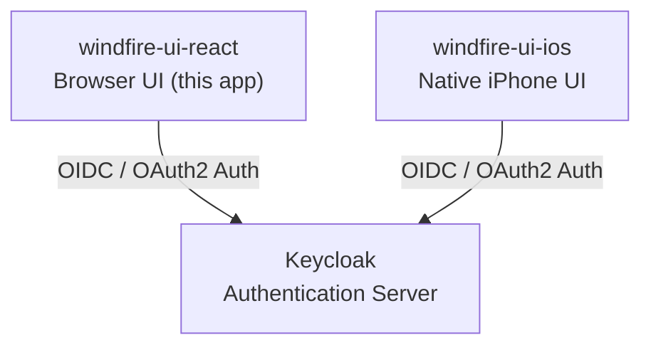

# Windfire UI

A browser-based UI for the Windfire application, built with React 18.

Windfire is designed to integrate different software components in a flexible and future-proof manner. This repository is the web client — one of two UI frontends in the system. It provides a login interface backed by Keycloak authentication and an authenticated dashboard visualizing the overall system architecture.

## Architecture

The Windfire system consists of two client UIs that share a centralized Keycloak authentication backend.



| Component | Technology | Role |
|---|---|---|
| windfire-ui-react | React 18, Browser | Web-based client UI |
| windfire-ui-ios | Swift / SwiftUI, iPhone | Native mobile client UI |
| Keycloak | Keycloak Server | Centralized identity and access management |

### Application Structure

```
windfire-ui-react/
├── public/                   # Static assets (index.html, icons, manifest)
├── src/
│   ├── auth/
│   │   ├── keycloakService.js  # Keycloak token & logout API calls
│   │   └── AuthContext.js      # React Context for global auth state
│   ├── components/
│   │   ├── LoginForm.js        # Login form (username/password + error display)
│   │   └── ArchitectureDiagram.js  # SVG system architecture visualization
│   ├── App.js                  # Root component: routes between login and dashboard
│   └── index.js                # React entry point
├── ssl/
│   ├── generate-ssl.sh         # Script to generate self-signed key + certificate
│   ├── key.pem                 # TLS private key (not committed — see .gitignore)
│   └── cert.pem                # TLS certificate (not committed — see .gitignore)
├── server.js                   # Production HTTPS server (Express + Node https)
├── .env_PLACEHOLDER            # Template for required environment variables
└── .env                        # Local environment config (not committed)
```

### Authentication Flow

This app uses the **OIDC Resource Owner Password Credentials** grant (direct credentials flow):

1. The user submits username and password via `LoginForm`.
2. `keycloakService.js` POSTs to `{KEYCLOAK_URL}/realms/{REALM}/protocol/openid-connect/token` with `grant_type=password`.
3. Keycloak returns an access token and a refresh token (both JWTs).
4. The access token is decoded client-side to extract the user's display name (`name`, `preferred_username`).
5. Tokens are stored in `sessionStorage` under the key `wf_auth` (cleared on browser close).
6. On logout, the refresh token is invalidated by POSTing to Keycloak's logout endpoint, then session storage is cleared.

`App.js` renders `LoginForm` when unauthenticated and the dashboard (with `ArchitectureDiagram`) once authentication succeeds.

---

## Keycloak Setup

The following configuration must be present in Keycloak before the application can authenticate users.

### 1. Create a Realm

Create a realm named **`windfire`** (this must match `REACT_APP_KEYCLOAK_REALM` in `.env`).

### 2. Create a Client

Inside the `windfire` realm, create a client with the following settings:

| Setting | Value |
|---|---|
| Client ID | `windfire` (must match `REACT_APP_KEYCLOAK_CLIENT_ID`) |
| Client type | OpenID Connect |
| Client authentication | Off (public client — no client secret) |
| Standard flow | Optional (not used by this app) |
| Direct access grants | **Enabled** (required — this app uses the password grant) |
| Valid redirect URIs | `http://localhost:3000/*` |
| Web origins | `http://localhost:3000` |

> **Why public + Direct Access Grants?** This is a browser SPA with no server-side component, so it cannot safely hold a client secret. The password grant posts credentials directly to Keycloak from the browser.

> If deploying to a non-localhost URL, add that URL to **Valid redirect URIs** and **Web origins** as well.

### 3. Create Users

In the `windfire` realm, create at least one user:

- Go to **Users → Add user** and set a username.
- Under the **Credentials** tab, set a password and set **Temporary** to **Off** so the user is not forced to reset on first login.

### 4. Configure Environment Variables

Copy `.env_PLACEHOLDER` to `.env` and fill in the values:

```bash
cp .env_PLACEHOLDER .env
```

```
REACT_APP_KEYCLOAK_URL=http://<keycloak-host>:<port>
REACT_APP_KEYCLOAK_REALM=windfire
REACT_APP_KEYCLOAK_CLIENT_ID=windfire
```

> `.env` is listed in `.gitignore` — do not commit it.

---

## Development

### Prerequisites
- Node.js 16+
- npm 8+
- A running Keycloak instance configured as described above
- A `.env` file with the three `REACT_APP_KEYCLOAK_*` variables set

### Available Scripts

#### `npm start`
Runs the app in development mode at [http://localhost:3000](http://localhost:3000).

#### `npm test`
Launches the test runner in interactive watch mode.

#### `npm run build`
Builds the app for production to the `build` folder.

#### `npm run serve`
Starts the production HTTPS server (`server.js`) to serve the `build` folder.
Requires `SSL_KEY_FILE` and `SSL_CRT_FILE` to be set (or defaults in `ssl/`).

#### `npm run eject`
**Note: this is a one-way operation. Once you eject, you can't go back.**

Exposes the underlying Webpack, Babel and ESLint configuration for full control.

---

## HTTPS / SSL Setup

HTTPS is enforced using SSL certificates. The app supports two modes:

| Mode | Command | Server | Use case |
|---|---|---|---|
| Production | `./run.sh` | `server.js` (Node `https` + Express) | Real deployments |
| Development | `./run.sh --dev` | CRA webpack-dev-server | Local dev with HTTPS |

### SSL Certificate Generation

SSL key and certificate files are stored in the `ssl/` directory (excluded from version control). A helper script is provided to generate a self-signed pair for local development:

```bash
bash ssl/generate-ssl.sh
```

This creates `ssl/key.pem` and `ssl/cert.pem` (valid 365 days, CN=localhost).

> **Self-signed certificates trigger browser security warnings.** For production, replace these files with certificates issued by a trusted Certificate Authority (e.g. [Let's Encrypt](https://letsencrypt.org/)).

`run.sh` calls `ssl/generate-ssl.sh` automatically if the certificate files are not found before the production build starts.

### Production Mode (default)

`./run.sh` builds the React app and starts the HTTPS server:

- HTTPS on port `443` (override with `PORT=<n>` in `.env`)
- HTTP redirect on port `80` (override with `HTTP_PORT=<n>`, disable with `HTTP_REDIRECT=false`)

```bash
./run.sh
```

> **Port 443 requires elevated privileges on Linux.** For non-root deployments, set `PORT=8443` (and optionally `HTTP_PORT=8080`) and place a reverse proxy (nginx, load balancer) in front.

### Development Mode

`./run.sh --dev` starts the CRA webpack-dev-server. To enable HTTPS in dev mode, set the following in your `.env`:

```
HTTPS=true
SSL_KEY_FILE=ssl/key.pem
SSL_CRT_FILE=ssl/cert.pem
```

Then run:

```bash
./run.sh --dev
```

The dev server will be available at `https://localhost:3000`.

### SSL Environment Variables

| Variable | Default | Description |
|---|---|---|
| `SSL_KEY_FILE` | `ssl/key.pem` | Path to TLS private key file |
| `SSL_CRT_FILE` | `ssl/cert.pem` | Path to TLS certificate file |
| `PORT` | `443` | HTTPS server port |
| `HTTP_PORT` | `80` | HTTP redirect server port |
| `HTTP_REDIRECT` | `true` | Set to `false` to disable HTTP→HTTPS redirect |

### Keycloak Redirect URI Update for HTTPS

When switching from HTTP to HTTPS, update the Keycloak client's **Valid redirect URIs** and **Web origins** to use `https://`:

| Setting | HTTP value | HTTPS value |
|---|---|---|
| Valid redirect URIs | `http://localhost:3000/*` | `https://localhost:3000/*` |
| Web origins | `http://localhost:3000` | `https://localhost:3000` |

> The app will fail to authenticate if the redirect URIs in Keycloak still point to `http://` after switching to HTTPS.
