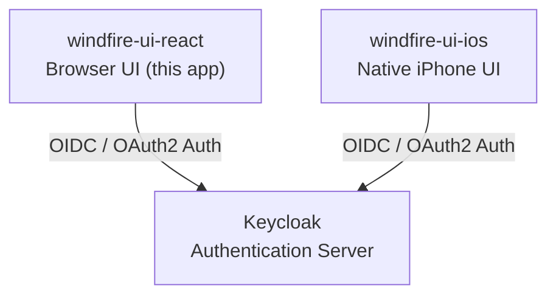

# Windfire UI React

A browser-based UI for the Windfire application, built with React 18.

Windfire is designed to integrate different software components in a flexible and future-proof manner. This repository is the web client, one of two UI frontends in the system.

## Architecture

The Windfire system consists of two client UIs that share a centralized Keycloak authentication backend.

| Component | Technology | Role |
|---|---|---|
| windfire-ui-react | React 18, Browser | Web-based client UI |
| windfire-ui-ios | Swift / SwiftUI, iPhone | Native mobile client UI |
| Keycloak | Keycloak Server | Centralized identity and access management |

## Development

### Prerequisites
- Node.js 16+
- npm 8+

### Available Scripts

#### `npm start`
Runs the app in development mode at [http://localhost:3000](http://localhost:3000).

#### `npm test`
Launches the test runner in interactive watch mode.

#### `npm run build`
Builds the app for production to the `build` folder.

#### `npm run eject`
**Note: this is a one-way operation. Once you eject, you can't go back.**

Exposes the underlying Webpack, Babel and ESLint configuration for full control.
